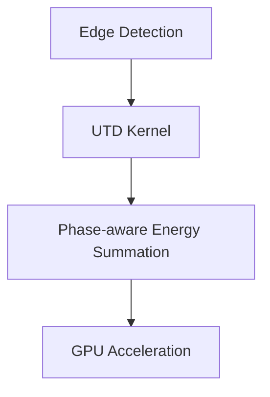

# Diffraction Model Research

## Evaluation Criteria
1. Computational complexity
2. Physical accuracy
3. GPU implementation feasibility

## Candidate Models

### Uniform Theory of Diffraction (UTD)
- **Pros**:
  - Well-established for audio frequencies
  - Edge-diffraction handling
- **Cons**:
  - Requires explicit edge detection
  - Increased ray complexity

### Wave-based Approaches
- **Pros**:
  - Physically accurate
  - Handles complex geometries
- **Cons**:
  - Computationally expensive
  - Difficult to parallelize

### Hybrid Approach
- Combine UTD for primary diffraction with:
  - Wavelet-based approximations for secondary effects
  - Precomputed diffraction kernels

## Implementation Roadmap

## References
- IEEE 2018: "Real-Time Audio Diffraction Using Modified UTD"